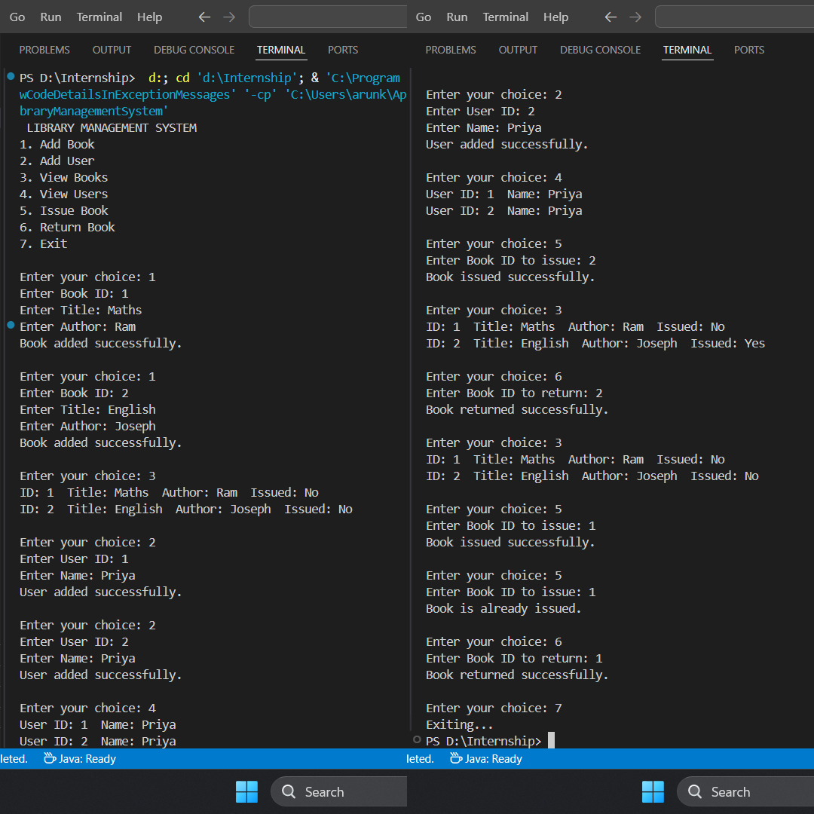

# Library Management System

## What I Did

- Used Java and OOP concepts to build a simple library system.
- Created 3 classes:
  - `Book`: ID, title, author, issued status.
  - `User`: ID and name.
  - `Library`: Manages books and users with ArrayLists.
- Added basic features:
  - Add/view books and users
  - Issue and return books
  - Menu-driven interface with `Scanner` input

## How It Works

- Displays a menu with options (Add, View, Issue, Return, Exit).
- Takes user input to perform each operation.
- Stores data in memory (using ArrayList).
- Runs in a loop until the user exits.

## Screenshot

